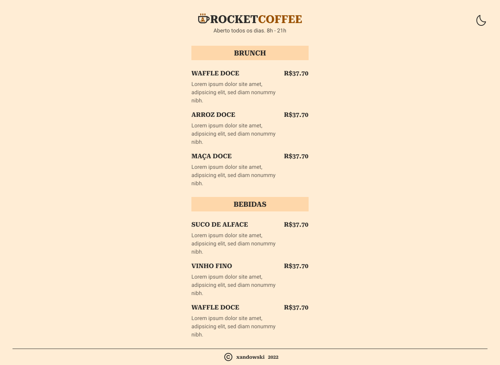
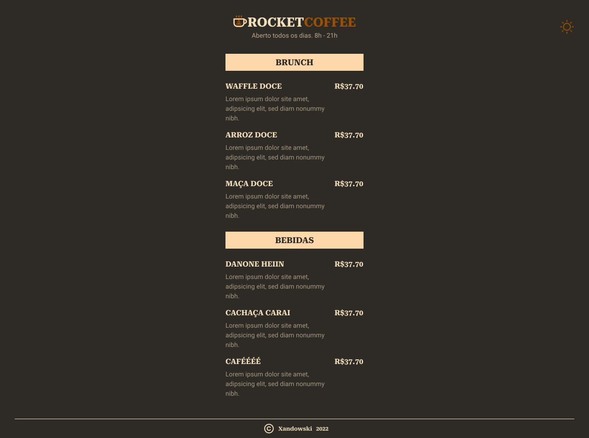

<div align="center">

<h1></h1>


This application was developed during Maratona Explorer 3.0, made by [Rocketseat](https://rocketseat.com.br/). 🚀

</div>

<div align="center">

[]()
[]()
[]()

[](https://discord.gg/rocketseat)
</div>

## ▶ Preview

[]()

## 📃 About

Rocketcoffee is a digital menu. This is a beginner project, so i decide to create a darkmode with javascript.

## 🎨 Layout

- [Layout Figma - Original](https://www.figma.com/community/file/1138209866997102496)
- [Layout Figma - with dark mode](https://www.figma.com/file/WtUcuq9qzh5Iz2GmKAJi1x/RocketCoffee-(Community)?node-id=508%3A2)

## 🛠 Build with

- [HTML]()
- [CSS]()
- [JavaScript](https://tailwindcss.com/)
- [Phospor-Icons](https://nodejs.org/en/)

## 🎞 Demo




## ⚙ Features


## 💻 Getting started

```sh
git clone https://github.com/xandowski/rocketcoffee.git && cd rocketcoffee
```

Download [live server](https://marketplace.visualstudio.com/items?itemName=ritwickdey.LiveServer) extension on vscode and run.
